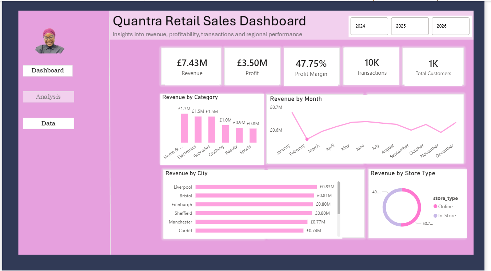
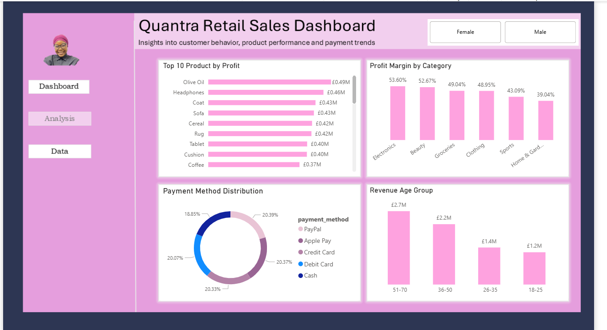
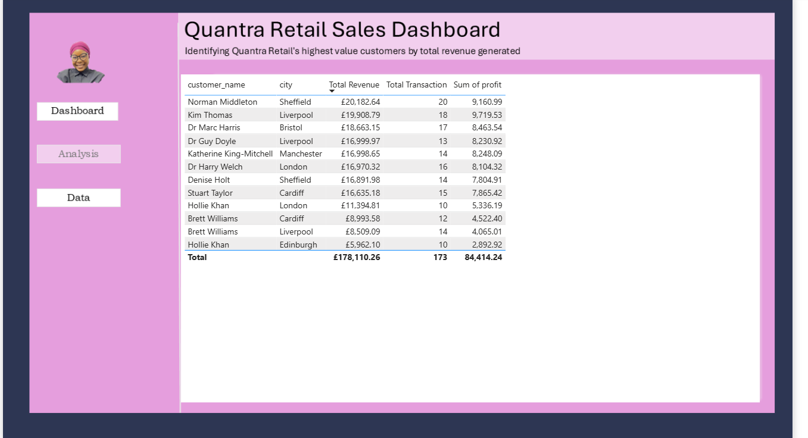
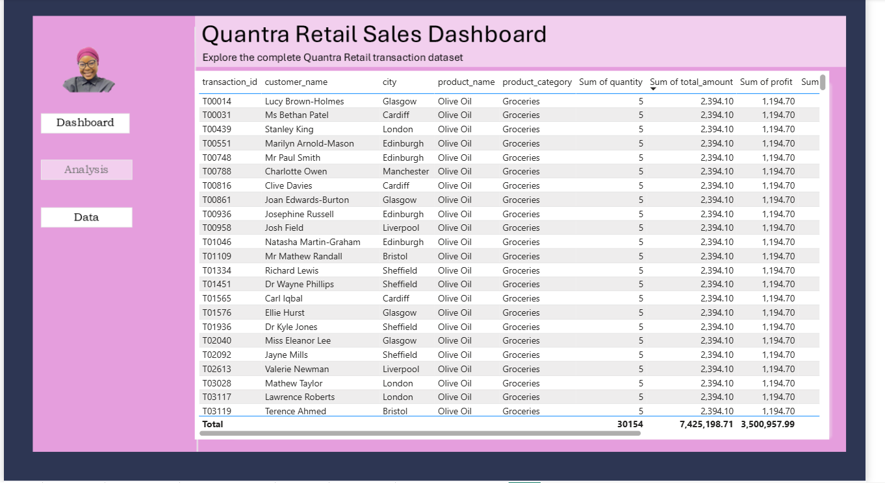
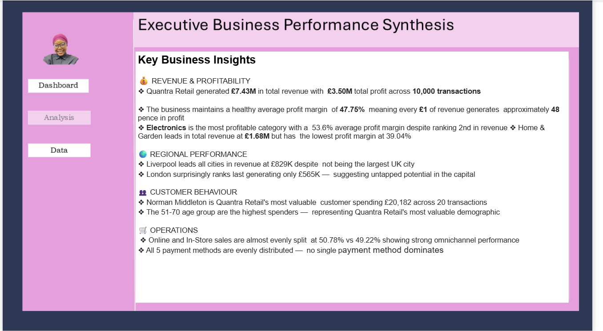
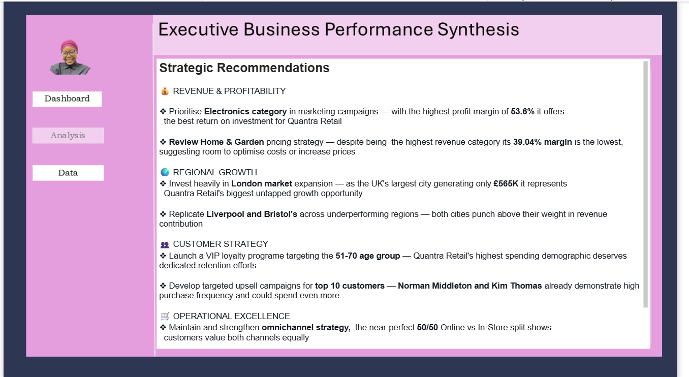
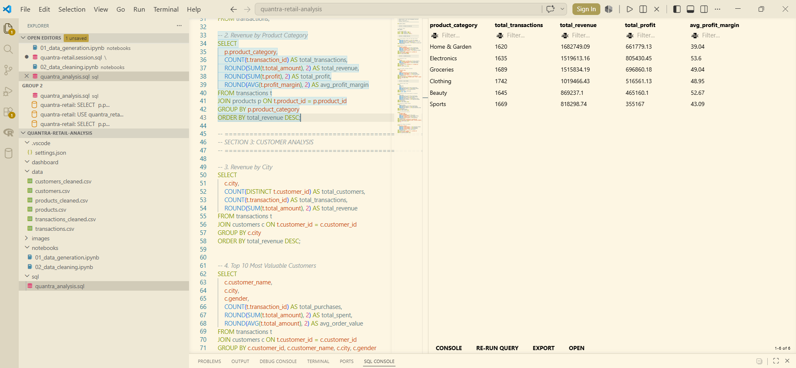

# 🛒 Quantra Retail Sales Performance Analysis

## 📌 Project Overview
Quantra Retail is a fictional UK-based retail company operating 
across 10 major cities including London, Manchester, Birmingham, 
Leeds and Bristol. This end-to-end analytics project transforms 
raw transactional data into actionable business intelligence 
using Python, SQL and Power BI.

This analysis covers 10,000 transactions across 1,000 customers 
and 30 products spanning 6 categories from 2024 to 2026.

## 🎯 Business Problem
Quantra Retail's management team lacks visibility into:
- Which product categories and regions drive the most revenue?
- Who are the most valuable customers?
- What are the seasonal sales patterns?
- Which payment methods are most popular?
- How do online vs in-store sales compare?
- Which products generate the highest profit margins?

## 🛠️ Tools & Technologies
| Tool | Purpose |
|------|---------|
| Python (Pandas, NumPy, Faker) | Data simulation and generation |
| Python (Matplotlib, Seaborn) | Exploratory data analysis |
| MySQL | Database management and SQL analysis |
| Power BI | Interactive dashboard development |
| DAX | Calculated measures and KPIs |
| GitHub | Version control and documentation |

## 📁 Project Structure
quantra-retail-analysis/

│

├── data/

│   ├── raw/          → Original generated datasets

│   └── cleaned/      → Cleaned and enriched datasets

│

├── notebooks/        → Python notebooks for generation and cleaning

├── sql/              → SQL analysis queries

├── dashboard/        → Power BI .pbix file

├── images/           → Dashboard and SQL screenshots

└── README.md

## 📊 Dashboard Pages
### 1. Revenue Performance

### 2. Customer & Product Analysis

### 3. Top 10 Customers

### 4. Data Table

### 5. Key Business Insights

### 6. Strategic Recommendations

## 🔍 SQL Analysis
9 analytical queries written in MySQL covering:
- Total revenue, cost and profit analysis
- Revenue by product category (JOIN query)
- Revenue by city (JOIN query)
- Top 10 most valuable customers (JOIN query)
- Monthly sales trends
- Online vs In-Store performance
- Revenue by payment method
- Top performing products (JOIN query)
- Profit margin by category (JOIN query)

### SQL Query Preview

## 📈 Key Findings
- 📌 Total revenue of £7.43M with £3.50M profit across 10,000 transactions
- 📌 Average profit margin of 47.75% across all product categories
- 📌 Electronics is the most profitable category at 53.6% margin
- 📌 Liverpool leads all UK cities in revenue at £829K
- 📌 London ranks last at £565K — representing untapped growth potential
- 📌 Online and In-Store sales split almost evenly at 50.78% vs 49.22%
- 📌 51-70 age group are Quantra Retail's highest spending demographic
- 📌 Norman Middleton is the most valuable customer at £20,182 revenue

## 👩🏽‍💻 About the Author
**Zuera Alabi**
Data Analyst | Python | SQL | Power BI | Excel

Behind every dataset is a decision waiting to be made, I help businesses find it.

🔗 [LinkedIn](https://www.linkedin.com/in/zuera-alabi-4b85a7282/)
🔗 [GitHub](https://github.com/zuera-alabi)
